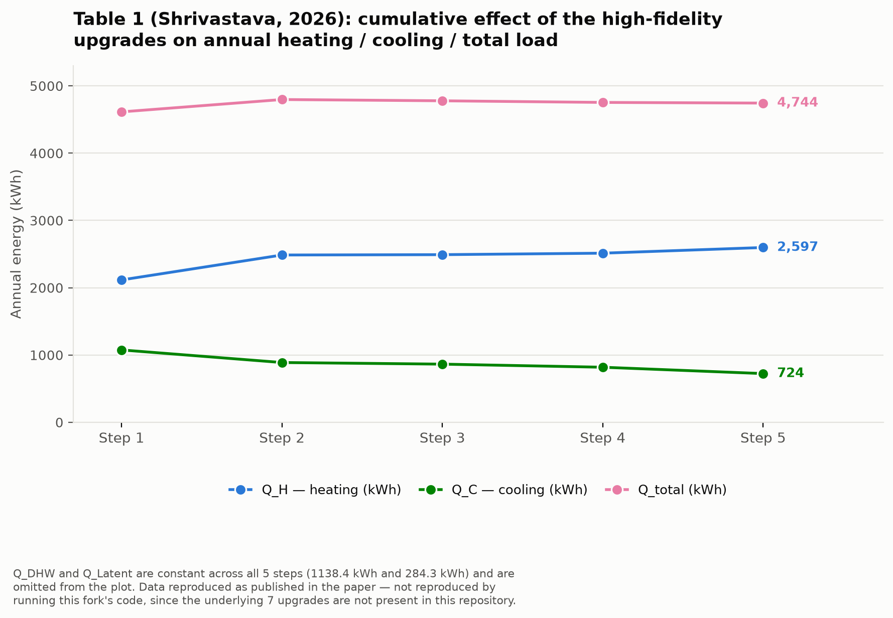

# Changes vs. the original pyBuildingEnergy repository

This document compares:

- **Upstream:** [`EURAC-EEBgroup/pyBuildingEnergy`](https://github.com/EURAC-EEBgroup/pyBuildingEnergy) (the original package)
- **This fork:** [`samiraghafarigousheh-sys/PyBuildingEnergy_AIBteam_AU`](https://github.com/samiraghafarigousheh-sys/PyBuildingEnergy_AIBteam_AU), specifically the vendored copy at `pyBuildingEnergy/`

and presents the fork's modification pipeline as three stages, in order:

| Stage | What | Present in this repo's code? |
|---|---|---|
| **1** | Add a latent-heat (moisture) model | ✅ Yes — verified in `source/utils.py` |
| **2** | High-fidelity upgrades documented in Shrivastava (2026) | ✅ Yes (6 of 7) — merged from [`Sarthak790/pybuildinenergy_AIB`](https://github.com/Sarthak790/pybuildinenergy_AIB), see [Stage 2](#stage-2--high-fidelity-upgrades-shrivastava-2026) |
| **3** | Final AIB-team fixes (ground coupling, hemisphere, adjacent zones, thermal bridges, validator warnings, etc.) | ✅ Yes — verified in `source/utils.py`, `check_input.py`, `DHW.py` |

## How the comparison was done

The vendored copy in this repo was checked out from upstream at version `2.0.3`, which corresponds to upstream commit [`9569b82`](https://github.com/EURAC-EEBgroup/pyBuildingEnergy/commit/9569b823cac4bcc50e8a3a40bd9188527748898a) ("update inputs file and fixing bug calculation options for ventilation", 2026‑01‑27). Diffing this repo's `pyBuildingEnergy/` against that exact upstream commit (rather than against upstream's current `master`, which has since moved on with unrelated features such as a full EN 15316 HVAC generation/distribution/emission suite and a ventilation-boundary rewrite) isolates only the changes actually made by this fork.

**Only three engine source files differ from upstream `2.0.3`:**

- `src/pybuildingenergy/source/utils.py` — the ISO 52016 calculation engine
- `src/pybuildingenergy/source/check_input.py` — the input validator
- `src/pybuildingenergy/source/DHW.py` — the domestic hot water calendar helper
- (as of Stage 2, also `src/pybuildingenergy/source/functions.py` and `src/pybuildingenergy/source/ventilation.py`, see below)

Everything else in `src/pybuildingenergy/` (`__init__.py`, `global_inputs.py`, `pybuildingenergy.py`, `source/generate_profile.py`, `source/graphs.py`, `source/iso_15316_1.py`, `source/table_iso_16798_1.py`) is byte-for-byte identical to upstream `2.0.3`.

---

## Stage 1 — Add a latent-heat (moisture) model

**Status: ✅ present in `source/utils.py`.**

Upstream's ISO 52016 implementation is sensible-heat only — it has no representation of indoor humidity at all. This fork added a full moisture mass-balance:

- new helper `calc_humidity_ratio(T_db, RH, Patm)` converts temperature/RH to humidity ratio.
- new per-timestep state (`x_air_old`, zone air mass `M_air`) tracks indoor humidity ratio across the simulation.
- occupant moisture gains and ventilation moisture transport are included each timestep.
- an HVAC latent load is computed whenever indoor humidity crosses a comfort setpoint during cooling (dehumidification, `x_air > 0.012 kg/kg`).
- the hourly output DataFrame gained two new columns: `x_air_in` (indoor humidity ratio) and `Q_Latent` (latent load, W), alongside the existing `Q_HC`, `T_op`, `T_ext`.

This dehumidification-only version is the base that Stage 3, item 5 below later extends to also cover humidification during heating.

---

## Stage 2 — High-fidelity upgrades (Shrivastava, 2026)

**Status: ✅ 6 of 7 merged into `functions.py`, `utils.py`, `ventilation.py`. 1 of 7 intentionally not merged (see item 2.7).**

A separate document, *"Documentation of High-Fidelity Upgrades to the pybuildingenergy Pipeline"* (Sarthak Shrivastava, July 9 2026), describes 7 upgrades intended to correct ISO 52016's tendency to overestimate peak cooling loads and underestimate passive heat dissipation, by injecting dynamic effects that only detailed engines like EnergyPlus normally capture.

The matching code was not on the `main` branch of the paper's companion repository, [`Sarthak790/pybuildinenergy_AIB`](https://github.com/Sarthak790/pybuildinenergy_AIB) — it was found on that repo's `prakhar_branch`. That branch's vendored `pyBuildingEnergy/` copy is otherwise an *older* snapshot of this fork (it predates Stage 3: it still carries the pre-fix Australia-calendar fallback in `DHW.py` and is missing all of `check_input.py`'s validator warnings and `utils.py`'s Stage-3 fixes), so the merge into this repo was done by cherry-picking only the genuinely new Stage-2 code onto the current Stage-3 state — nothing from Stage 3 was reverted, and `check_input.py`/`DHW.py` were left untouched since that branch's versions of those two files are strictly behind this fork's.

| # | Upgrade | File(s) | In this repo? |
|---|---|---|---|
| 1 | Dynamic window properties (Karlsson & Roos model) | `functions.py`, `utils.py` | ✅ |
| 2 | Escaping solar radiation (15% internal reflectance) | `utils.py` | ✅ |
| 3 | Split solar transmission / glass absorption | `utils.py` | ✅ |
| 4 | Variable air density for ventilation (ideal gas law) | `ventilation.py` | ✅ |
| 5 | Non-linear long-wave sky radiation (Swinbank model) | `utils.py` | ✅ |
| 6 | Transient heat accumulation / thermal-mass node skew | `utils.py` | ✅ |
| 7 | Coupling of thermally conditioned zones (heat bleed) | `utils.py` | ❌ not merged — superseded by Stage 3, item 7 |

A wind-driven exterior convective coefficient (`h_ce = 4.0 + 4.0·v_wind`, replacing the fixed nominal value on `EXT` surfaces) came along with items 1 and 5 in the source branch and was merged too, since item 5's radiative-coefficient update reads from the same per-timestep external-coefficient arrays.

**One deviation from the source branch:** in `prakhar_branch`, the dynamic-window-properties call (item 1) was nested inside the `if colname in sim_df.columns:` shading-lookup branch, so a window lacking a shading-factor column would fall through to `tau_win = 0.0` — silently zeroing its solar gain for every hour, not just correcting it for incidence angle. This repo's merge computes the dynamic window properties for every window unconditionally (whenever `g_gl_wi_t[Eli] != 0`), independent of whether shading data exists, and keeps `tau_win = 0.0` only for genuinely opaque `EXT`/`ADJ` surfaces (where it is correct — opaque walls have no window transmission).

### 2.1 Dynamic window properties — ✅ merged (placement fixed, see deviation note above)
**Reasoning:** ISO 52016 assumes constant U_win and g_win, but both vary with wind speed and solar incidence angle; an angle-dependent correction factor avoids over-admitting solar heat at steep sun angles.
```python
az_map = {"NV": 0.0, "EV": 90.0, "SV": 180.0, "WV": 270.0, "HOR": 0.0}
current_window_azimuth = az_map.get(orientation_elements[Eli], 0.0)

g_dyn, u_dyn = dynamic_window_properties(
    g_normal=g_gl_wi_t[Eli],
    u_nominal=building_object["building_surface"][Eli]["u_value"],
    alpha_sol_t=sim_df['solar_altitude'].iloc[Tstepi],
    phi_sol_t=sim_df['solar_azimuth'].iloc[Tstepi],
    beta_k_t=float(building_object["building_surface"][Eli]["orientation"]["tilt"]),
    gamma_k_t=current_window_azimuth,
    wind_speed_m_s=sim_df['WS10m'].iloc[Tstepi]
)
```

### 2.2 Escaping solar radiation — ✅ merged as-is
**Reasoning:** the standard traps 100% of transmitted solar radiation inside the zone; in reality some reflects back out through the glazing, and ignoring this inflates summer cooling load.
```python
internal_reflectance = 0.15

Phi_sol_dir_zt_t += tau_win * (
    sim_df[f'I_sol_dif_{orientation_elements[Eli]}'].iloc[Tstepi] +
    sim_df[f'I_sol_dir_w_{orientation_elements[Eli]}'].iloc[Tstepi] * F_sh_obst_wi_t
) * area_elements[Eli] * (1 - Ffr_wi) * (1.0 - internal_reflectance)
```

### 2.3 Split solar transmission and glass absorption — ✅ merged as-is
**Reasoning:** the standard applies g_win instantly to interior nodes; physically, part of the solar energy is absorbed into the glass pane and conducts in gradually, creating thermal lag.
```python
tau_win = 0.85 * g_dyn    # 85% directly transmitted light
alpha_win = 0.15 * g_dyn  # 15% absorbed heat in the glass pane

a_sol_pli_eli[0, Eli] = alpha_win * (1 - Ffr_wi)
```
The merge additionally feeds the dynamic U-value into the window's conductance node (`h_pli_eli[0, Eli]`), which the source branch also did alongside this item.

### 2.4 Variable air density for ventilation — ✅ merged as-is
**Reasoning:** ventilation heat transfer uses a constant air density (1.204 kg/m³); hot summer air is less dense, so this overestimates the thermal mass of incoming outdoor air during peak cooling.
```python
T_avg_K = ((float(Tz) + float(Te)) / 2.0) + 273.15
dynamic_rho_air = 101325.0 / (287.05 * T_avg_K)

Hve_k_t = c_air * dynamic_rho_air * (qv_arg_in_m3_h / 3600.0)
```

### 2.5 Non-linear long-wave sky radiation — ✅ merged as-is
**Reasoning:** the baseline model assumes a constant 11 K air-to-sky offset, underestimating night-time radiant cooling; a Swinbank formulation captures this non-linearly.
```python
T_air_K = sim_df["T2m"].iloc[Tstepi] + 273.15
T_sky_K = 0.0552 * (T_air_K ** 1.5)

sigma = 5.67e-8
epsilon_surf = 0.9
T_surf_K = Theta_old[ri] + 273.15

phi_sky_eli_t = sky_factor_elements[Eli] * epsilon_surf * sigma * ((T_surf_K ** 4) - (T_sky_K ** 4))
heat_radiative_elements_external[Eli] = 4.0 * epsilon_surf * sigma * (((T_surf_K + T_sky_K) / 2.0) ** 3)
```

### 2.6 Transient heat accumulation (thermal-mass skew) — ✅ merged, ground-node handling preserved
**Reasoning:** the rigid Class-D RC-network distributes thermal mass equally across wall nodes (25% each), causing unrealistic instant cooling-load spikes when solar radiation hits the exterior.
```python
node_weights = [0.125, 0.25, 0.25, 0.25, 0.125]

for i in range(len(el_type)):
    if el_type[i] == "OP" or el_type[i] == "ADJ":
        for node in range(5):
            kappa_pli_eli_[node, i] = list_kappa_el[i] * node_weights[node]
    elif el_type[i] == "GR":
        # ground-floor distribution kept as originally specified (unchanged by this upgrade)
        kappa_pli_eli_[2, i] = list_kappa_el[i] / 4
        kappa_pli_eli_[3, i] = list_kappa_el[i] / 2
        kappa_pli_eli_[4, i] = list_kappa_el[i] / 4
```

### 2.7 Coupling of thermally conditioned zones — ❌ not merged (superseded by Stage 3, item 7)
**Reasoning:** the standard assumes zero heat transfer between conditioned zones; in residential apartments, heat bleeding through party walls to adjacent units/corridors is significant.
```python
Phi_tr_adj_zones = 0.0
for adj_zone in building_object.get("adjacent_zones", []):
    T_adj_zone = 20.0  # Baseline or dynamic schedule
    T_current_zone = Theta_int_old

    for area, u_val in zip(adj_zone["area_facade_elements"], adj_zone["transmittance_U_elements"]):
        heat_bleed = u_val * area * (T_adj_zone - T_current_zone)
        Phi_tr_adj_zones += heat_bleed

Phi_int_z_t += Phi_tr_adj_zones
```

This item was deliberately **not** merged: it targets the same physical problem as Stage 3, item 7 (a fixed 20 °C neighbour temperature bled in as a flat gain, vs. Stage 3's `conditioned` flag that reads the neighbour's *actual* setpoint through the proper ISO 13789 zone-temperature term), and the two are not interchangeable — applying both would double-count the adjacent-zone heat exchange. Stage 3's version is the one implemented in this repo, since it already existed and is the more physically direct approach.

### Reported result (as published by the paper, describes a different codebase)

The paper's Table 1 shows the annual result after cumulatively applying its 7 upgrades on top of *its own* baseline (not this repo's Stage 3 fixes):



| Step | Q_H (kWh) | Q_C (kWh) | Q_DHW (kWh) | Q_Latent (kWh) | Q_total (kWh) |
|---|---:|---:|---:|---:|---:|
| 1 | 2,115.5 | 1,075.0 | 1,138.379 | 284.3281 | 4,613.207 |
| 2 | 2,486.0 | 888.0 | 1,138.379 | 284.3281 | 4,796.707 |
| 3 | 2,491.0 | 864.0 | 1,138.379 | 284.3281 | 4,777.707 |
| 4 | 2,513.0 | 818.0 | 1,138.379 | 284.3281 | 4,753.707 |
| 5 | 2,597.402 | 723.6886 | 1,138.379 | 284.3281 | 4,743.797 |

Reading the paper's own framing: cooling load (Q_C) falls steadily (1,075 → 724 kWh, −33%) as each upgrade removes another source of over-admitted solar/ventilation heat, while heating load (Q_H) rises correspondingly (2,116 → 2,597 kWh) as the same physics (escaping radiation, thinner solar admission, colder night sky) that suppresses summer cooling also suppresses winter free heat. Q_DHW and Q_Latent are unaffected by any of the 7 upgrades (none of them touch domestic hot water or the moisture balance) and are held constant across all 5 rows.

**These specific numbers are not reproduced by this repository as-is**: they describe the paper's own baseline (before this fork's Stage 3 fixes), run against its own case-study weather/geometry data, which was never part of this repo. This repo's code now runs 6 of the 7 upgrades *combined with* Stage 3 (a materially different baseline — e.g. Stage 3's ISO 13370 partition-wall guard and conditioned-adjacent-zone coupling change the same heat-loss paths these upgrades target), so a fresh run of the Barry St case study with the merged engine would not be expected to reproduce this exact table, only the same qualitative direction (lower Q_C, higher Q_H) on whichever inputs it's run against.

A full-year smoke test (the `test_general.py` BESTEST-derived fixture, 9,504 hourly timesteps, run against an EPW file since this environment has no PVGIS network access) confirmed the merged engine completes without errors and produces non-zero, varying `Q_Latent`/`x_air_in` output — but that run used a generic single-zone fixture with mismatched climate data purely to validate the code path, not the actual case-study numbers, so no energy totals from it are reported here.

---

## Stage 3 — Final AIB-team fixes

**Status: ✅ present in `source/utils.py`, `source/check_input.py`, `source/DHW.py`.**

These were made while validating this engine's output against EnergyPlus for an Australian apartment case study (305, 50 Barry St, Carlton VIC) — a mid-floor apartment surrounded by other conditioned units — where several ISO 52016 assumptions baked into the original package (aimed mainly at detached, ground-contact, Northern-Hemisphere buildings) didn't hold and produced systematic errors against the EnergyPlus reference model.

### `source/utils.py` — ISO 52016 engine

#### 1. Southern Hemisphere coldest-month was hardcoded to January

```python
# upstream
coldest_month = 1
building_object["building_parameters"]["coldest_month"] = coldest_month
```

The coldest month used for internal design-condition calculations was hardcoded to January, which is correct for the Northern Hemisphere but is midsummer in Australia.

**Fix:** the coldest month is now chosen from the building's latitude — July for latitude < 0 (Southern Hemisphere), January otherwise — and stored under `climate_parameters.coldest_month` instead of directly under `building_parameters`.

#### 2. Ground-floor thermal resistance was a fixed constant, and missing R_si

```python
# upstream
thermal_resistance_floor = 5.3
equivalent_ground_thickness = wall_thickness + lambda_gr * (thermal_resistance_floor + R_se)
```

`Calculate_ground_floor` used a hardcoded `thermal_resistance_floor = 5.3 m²K/W` for every building regardless of the actual slab construction, and the ISO 13370 equivalent-thickness formula only added the external surface resistance (`R_se`), omitting the internal one (`R_si`).

**Fix:** the raw slab U-value is now looked up dynamically from the surface named `"Slab to ground"` in `building_surface` (falling back to 2.5 W/m²K if not found), and the floor resistance is derived from it: `Rf = 1/U_raw − R_si − R_se`. Both `R_si` and `R_se` are now included in the equivalent ground thickness calculation, matching the ISO 13370 definition.

#### 3. Ground-coupling wrongly applied to interior partition walls

The basement-wall U-value correction (ISO 13370 soil-adjustment) triggered for any vertical surface (`tilt == 90`) with `sky_view_factor == 0`. Interior partition walls facing a neighbouring apartment or corridor also have `sky_view_factor == 0` (they don't see the sky) but are **not** in contact with the ground, so they were incorrectly getting their U-value overwritten with a heavily-insulated "soil-adjusted" value.

**Fix:** added `calc_basement_wall_u_value()` and excluded surfaces that carry a `name_adj_zone` (i.e. face a named adjacent zone) from the ISO 13370 correction — their U-value stays as the user-supplied value (e.g. 2.50 W/m²K for a party wall). The same guard was applied to the ground-contact area search (`sog_area`) used elsewhere in the engine.

#### 4. Azimuth convention — double-rotation risk

There was no documentation at the point where surface azimuths are assigned to explain that `surface["orientation"]["azimuth"]` is **absolute** (0°=N, 90°=E, 180°=S, 270°=W) while `building["azimuth_relative_to_true_north"]` is an **additive offset** applied on top of it at solar-calculation time. Supplying already-absolute surface azimuths *and* a non-zero building offset silently double-rotates the building.

**Fix:** added an explicit comment at the point of use, and a corresponding validator warning (see `check_input.py` below).

#### 5. Latent load only handled dehumidification, not humidification

Building on the Stage 1 latent-heat model, the HVAC latent-load balance still only removed moisture (dehumidification) when indoor humidity rose above the comfort setpoint during cooling; there was no corresponding humidification branch for when indoor air dropped below the comfort setpoint during heating, so heating-season latent load was always zero.

**Fix:** extended the Stage 1 moisture mass-balance with a humidification branch (heating, `x_air < 0.004 kg/kg`) alongside the existing dehumidification branch (cooling, `x_air > 0.012 kg/kg`), both converted to a latent load in Watts and both contributing to the `Q_Latent` output column.

#### 6. No support for custom/extraction internal gains

The internal-gains calculation only recognised three hard-coded gain types: `occupants`, `appliances`, `lighting`. Any other entry in `building_parameters.internal_gains` (e.g. a process load, or an exhaust fan representing heat *extraction*) was silently ignored.

**Fix:** any additional `internal_gains` entry is now applied using its own hourly weekday/weekend schedule. A **negative** `full_load` value acts as heat extraction (e.g. a bathroom/kitchen exhaust fan) rather than a gain.

#### 7. Phantom heat loss through conditioned adjacent zones

The temperature of an unconditioned adjacent zone (`theta_ztu`) was always derived from the ISO 13789 `b_ztu` reduction-factor formula, which assumes the neighbouring space floats with outdoor conditions. If the adjacent zone was actually another **conditioned** unit (a heated/cooled neighbouring apartment), this formula still pulled its temperature partway toward the outdoor temperature, producing a fictitious heat loss through the party wall even though the real ΔT across it is close to zero.

**Fix:** added a `conditioned` flag to the adjacent-zone configuration. When `adj_zone["conditioned"] is True`, the zone temperature is taken directly from `adj_zone["setpoint"]` instead of running it through the `b_ztu` formula. Applies to both the single- and multi-adjacent-zone code paths. (See the note under Stage 2, item 2.7 above — the paper proposes a different, fixed-temperature heat-bleed approach to the same problem; this repo implements the setpoint-coupling approach instead.)

#### 8. Surface-level thermal bridges were ignored when exposed perimeter was zero

Thermal bridges were only calculated from the building's exposed perimeter (`psi_value × exposed_perimeter`), which is zero for a mid-floor apartment with no ground contact — even though it still has real thermal bridges at window frames and slab-edge junctions with neighbouring units.

**Fix:** added a surface-level thermal-bridge term, `Σ (psi_junction × length_junction + psi_frame × perimeter_frame)`, summed across `building_surface` and added into `thermal_bridge_heat`. This now contributes correctly regardless of whether the surface has any ground-exposed perimeter.

#### 9. Silent schedule/weather hour-offset

If the internal-gains schedule DataFrame and the weather DataFrame started on different clock hours (e.g. one indexed from midnight, the other from 1am), all internal gain schedules would be silently offset by an hour relative to the weather data, with no indication anything was wrong.

**Fix:** added a runtime check comparing `profile_df.index[0].hour` to `sim_df.index[0].hour` and raising a `warnings.warn` if they differ.

### `source/check_input.py` — input validator

Three new validator warnings were added to `sanitize_and_validate_BUI`, surfaced before a simulation runs rather than discovered after the fact in the output:

- **Ventilation profile flat at 1.0** — warns when `ventilation_profile.weekday` is a constant `1.0` across all 24 hours, since this applies full mechanical/natural ventilation rate overnight and through winter, which is rarely the intended behaviour (background infiltration is usually closer to ~0.15).
- **Azimuth double-rotation risk** — warns when `azimuth_relative_to_true_north != 0` while surfaces already carry cardinal (0/90/180/270°) azimuths, flagging the double-rotation risk described in utils.py fix #4 above, and lists the affected surface names.
- **Zero surface thermal capacity vs. non-`class_i` construction class** — warns when every surface has `thermal_capacity == 0` but `building.construction_class` is not `class_i`. In that combination the internal zone capacitance is still derived from the (non-zero) construction class even though no surface actually carries thermal mass, which inflates the residual term in the energy-balance Sankey diagram.

### `source/DHW.py` — domestic hot water calendar lookup

Upstream's `get_calendar_by_name(nation_name)` looked up a country in the `workalendar` registry, falling back to a small hard-coded map of Western-European countries (Italy, Germany, France, Spain, Austria, Switzerland) if the registry lookup failed.

**Fix:** the parameter was renamed to `location_name` (since state/territory names are also valid, not just countries), and the hard-coded fallback map was removed — a failed lookup now raises a clear `ValueError` directly. During development this fork temporarily carried an Australia-specific state/territory fallback map instead of the European one; that was subsequently removed in favour of relying purely on `workalendar`'s own registry (which already covers Australian states/territories), so no country/state is special-cased in the final version.

### Other differences

- **`pyproject.toml`** — `packaging` dependency pin loosened from `==25.0` to `>=23.2,<26` for broader environment compatibility (e.g. Google Colab).
- **`tests/test_general.py`** — the ventilation fixture used by one test was updated to the `type_ventilation` / `ventilation.ventilation_type` mechanical-ventilation config shape, and an assertion string was updated (`"Floor heating 1"` → `"Floor heating"`).
- **`src/pybuildingenergy/data/`** (upstream's built-in `building_archetype.py` / archetype JSON) is not present in this fork's vendored copy — it isn't used by the Barry St case study.
- **New case-study files** were added under `tests/`: `AIBpybuildingenergy_305_unit.py`, `climate_setpoints.py`, `sample.py`, `sample_test.py`, and `output_test/` — these configure and validate the Barry St, Carlton apartment model rather than changing the engine itself.

### Related: unit occupancy inputs (case-study config, not the engine)

`tests/AIBpybuildingenergy_305_unit.py` (the Barry St case-study configuration) had its occupant-dependent inputs corrected for a 2-person household:

- Occupants internal gain: `4 → 8 W/m²` (2 people × 80 W ÷ 20 m²)
- DHW `unit_count`: `1 → 2`

Window dimensions (1.5 × 1.1 m) and appliance gains (7 W/m²) from an earlier correction were retained.

---

## Note: upstream has moved on independently

Upstream `master` has continued to evolve since the `2.0.3` snapshot this fork is based on, adding a large EN 15316 HVAC generation/distribution/emission/storage suite (`heat_pump_15316_4_2.py`, `distribution_15316_3.py`, `emission_15316_2.py`, `cogeneration_15316_4_4.py`, etc.), an EN 16798‑5‑1 AHU/ventilation model, and a rewritten `S_ve`/`H_ve` ventilation-boundary formulation. None of that is present in this fork — it reflects upstream's independent development after this fork's snapshot, not something removed or reverted here.
